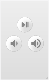

# htpc-remote-control
Node project to remotely control a home theater PC

Runs a little web server on your Windows PC that serves a user interface with some media control buttons. Visit that server with your phone or tablet. When you press one of the buttons a signal is send back to the server (your PC). The server then calls system commands on your PC that control the volume and playback of audio or video that is running on your PC. 
